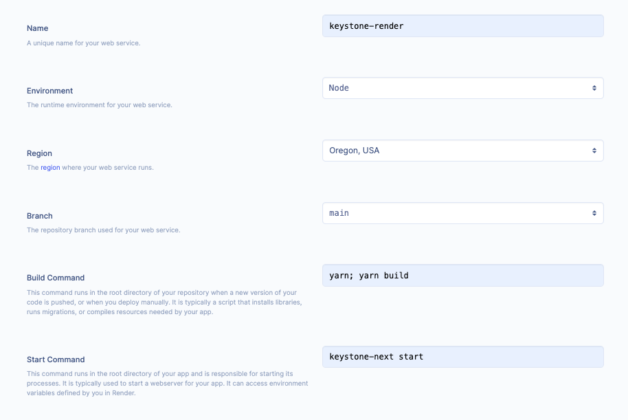

This post will try to explain how you can deploy your keystone-6 app with Render and the main things to look out for when you are doing it.

A couple of assumptions or pre-requisites:  
- Create a keystone app with `yarn create keystone-app`
- Go to [render](https://render.com/) and create an account

You can also check the [repo](https://github.com/tiagofsanchez/keystone-render) I created for more details if needed.

# Creating a Database

Go to the Databases section and just create a database for your project, this is step is very simple and you will need to define a Name, Database and User. 

After that select the "Starter" plan and create the database. This will take a couple of minutes to be finalize.

# Setting up your Web Service

After that, in your Services section, you can will need to set up a new web service and for that you will need to connect your repo or any public repo. 

You will have to give the web service a name and select the environment - in this example we will be using node. In the Build command field you will need to type `yarn; yarn build` and for the start command type `keystone-next start`.



To make this finally work you will need to add your environment variables - I suggest you use the Env Groups to make things easier for you.

You should be able to "spin-off" your keystone app in prod, however you might facing a couple of issues on your graphQL api endpoint. 

# Enable your graphQL

Now tou will need to get back into your keystone and enable your graphQL on the `keystone.ts` file. 

```ts:title=keystone.ts
export default withAuth(
  config({
   ...
    graphql: {
      apolloConfig: {
        playground: true,
        introspection: true,
      },
    },
  })
);
```

# Add Prisma migrate deploy

Lastly you will need to tweak your Web Service scripts so that the your are are checking if you need to deploy your prisma migrations to your the database that you previously set up.  

In your start command you will need to have the following: `keystone-next prisma migrate deploy ; keystone-next start`


Hope this was helpful.
